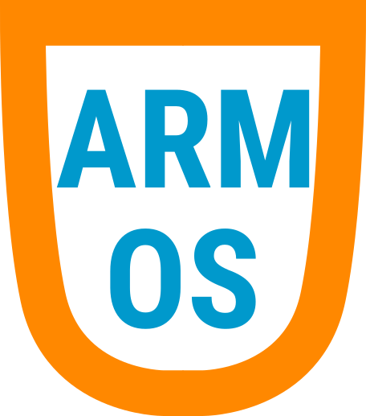

ARMOS 
=====

ARMOS is a operating system kernel targeting the ARMv8-A architecture. Hereby,
the Raspberry Pi 3B+ serves as the main test platform. The overall goal of this
project is about providing some insights of operating system development in the
context of the ARM architecture.

# Build Process

To build the kernel8.img image file, the following requirements must be met:

- GNU C++ Compiler for ARMv8-A: `aarch64-linux-gnu-gcc`
- GNU Binary Utilities: `community/aarch64-linux-gnu-binutils`
- Python ELF Parser: `lief`

On Arch Linux, those requirements can be satisfied by installing following
packages:

```bash
pacman -S aarch64-linux-gnu-gcc
pacman -S aarch64-linux-gnu-binutils
pip install lief
```

Afterwards, the kernel can be compiled, linked and converted to binary format
using the following make target:

```bash
make all
```

If it is necessary to debug the build process, addition output can be enabled
using the `-verbose` suffix:

```bash
make all-verbose
```

To select the target user-space application, the APP variable can be changed.
```bash
make APP=<app> all
```

# Documentation

ARMOS uses Doxygen to generated documentation from annotations within the
header files. The following make target will produce the HTML documentation
located in the `doc/build/index.html` subdirectory:

```bash
make doc
```

**IMPORTANT:** Every committed interfaces must be documented via Doxygen!

# Debugging

The primary test platform features the Raspberry Pi 3B+ which can be
virtualized using QEMU. To do so, the appropriate package must be installed.
For Arch Linux, the package can be installed as following:

```bash
pacman -S qemu-arch-extra 
```

To run QEMU, the following make target can be used:

```bash
make qemu
```

If a GDB instance should be launched and connected to QEMU, the make target
below can be used:

```bash
make qemu-gdb
```
